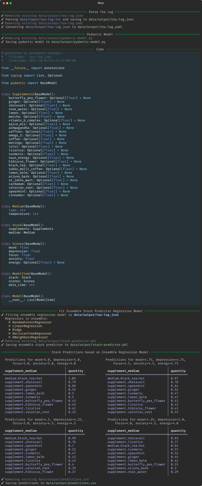

# Tea Log Analysis

I maintain a "tea" log in Apple Notes to subjectively quantify, the effect on my well-being, of my experiments with nootropics and adaptogens. The well-being dimensions quantified are: `mood`, `depression`, `anxiety`, `focus` and `energy`. Below is a sample excerpt of some entries from the tea log,

```
Date:  September 4, 2023
- [] Supplements:
- 0.75 shatavari, 0.75 Arjuna bark, 0.75 rose water + cardamom (3:1), 1.5 spearmint, 8 hot black tea
    -  Mood: 3.0, Depression: 3.0, Focus:  3.0, Anxiety: 3, Energy: 4.0
   - Time: 9:45

Date:  September 5, 2023
- [] Supplements:
- 0.75 licorice, 0.75 ginger, 0.75 tulsi, 0.75 spearmint, 0.75 butterfly pea flower, 0.75 matcha + cinnamon (3:1), 8 hot black tea
    -  Mood: 3.5, Depression: 3.0, Focus:  4.0, Anxiety: 3, Energy: 3.5
   - Time: 9:45

Date:  September 6, 2023
- [] Supplements:
- 0.75 valerian root, 0.75 shatavari, 0.75 tulsi, 0.75 spearmint, 0.75 Arjuna bark, 0.75 hibiscus + nutmeg (3:1), 8 hot black tea
    -  Mood: 3.5, Depression: 3.0, Focus:  4.0, Anxiety: 3, Energy: 3.5
   - Time: 9:15

Date:  September 7, 2023
- [] Supplements:
- 1.5 licorice, 0.75 turmeric, 0.75 lemon balm, 0.75 St. John’s Wart, 8 hot black tea
    -  Mood: 4.0, Depression: 3.0, Focus:  4.0, Anxiety: 3, Energy: 3.5
   - Time: 9:30
```

This [Hy](https://github.com/hylang/hy) script provides a set of command-line utilities for parsing, modeling, and predicting data from a tea log. For a given well-being score, an ensemble model attempts to predict a stack consisting of *n* supplements that can be used to achieve the score. The script uses various libraries and tools for data processing, analysis, and visualization. Below is a brief overview of the available commands and options.

## Installation

Before you can use this script, make sure you have the required libraries installed. You can install them using `pip`:

```bash
pip install -r requirements.txt
```

Install the package using ``setup.py`` (``--user`` is optional)

```bash
python3 setup.py install --user
```
or in development mode,

```bash
python3 setup.py develop --user
```

## Command Line Options

### `parse-tea-log`

Parse a tea log file and save the data as JSON and/or YAML.

```bash
hy main.py parse-tea-log
  --tea_log <path-to-tea-log-file>
  --output-json <path-to-output-json-file>
  [--output-yaml <path-to-output-yaml-file>]
```

- `--tea_log`: Path to the input tea log file (required).
- `--output-json`: Path to the output JSON file (required).
- `--output-yaml`: Path to the output YAML file (optional).

### `pydantic-model`

Generate a Pydantic model based on the parsed tea log data and optionally save it to a file.

```bash
hy main.py pydantic-model
  --tea-log <path-to-tea-log-json>
  [--show]
  [--output-model <path-to-output-model-file>]
```

- `--tea-log`: Path to the parsed tea log JSON file (required).
- `--show`: Show the generated Pydantic model code in the console (optional).
- `--output-model`: Path to the output Pydantic model Python file (optional).

### `fit`

Fit an ensemble stack predictor regression model to the parsed tea log data and save it.

```bash
hy main.py fit
  --tea-log <path-to-tea-log-json>
  --output-pickle <path-to-output-pickle-file>
```

- `--tea-log`: Path to the parsed tea log JSON file (required).
- `--output-pickle`: Path to the output model pickle file (required).

### `predict`

Use the fitted ensemble stack predictor model to make predictions based on input scores and optionally save the predictions to a CSV file.

```bash
hy main.py predict
  --fit-file <path-to-fitted-model-pickle>
  --mood <comma-separated-mood-scores>
  --depression <comma-separated-depression-scores>
  --anxiety <comma-separated-anxiety-scores>
  --focus <comma-separated-focus-scores>
  --energy <comma-separated-energy-scores>
  [--output-predictions <path-to-output-predictions-csv>]
```

- `--fit-file`: Path to the fitted model pickle file (required).
- `--mood`: Comma-separated mood scores (required).
- `--depression`: Comma-separated depression scores (required).
- `--anxiety`: Comma-separated anxiety scores (required).
- `--focus`: Comma-separated focus scores (required).
- `--energy`: Comma-separated energy scores (required).
- `--limit`: The number of predictions to display (optional, default = 10).
- `--output-predictions`: Path to the output predictions CSV file (optional).

### `run-pipeline`

Run a pipeline of tasks specified in a JSON configuration file.

```bash
hy main.py run-pipeline
  --pipeline-file <path-to-pipeline-json>
  [--output-html <path-to-output-html-report>]
```

- `--pipeline-file`: Path to the pipeline configuration JSON file (required).
- `--output-html`: Path to the output HTML report file (optional).

## Usage Examples

Here are some usage examples for the available commands:

```bash
# Parse a tea log and save it as JSON
hy main.hy parse --tea_log "tea-log.txt" --output-json "tea-log.json"

# Parse a tea log and save it as JSON and YAML
hy main.py parse-tea-log --tea_log tea-log.txt --output-json tea-log.json --output-yaml tea-log.yaml

# Generate a Pydantic model from a parsed tea log JSON file and show syntax highlighted code
hy main.hy pydantic-model --tea-log "tea-log.json" --show 

# Generate a Pydantic model from a parsed tea log JSON file and save it
hy main.py pydantic-model --tea-log tea-log.json --output-model tea-log-pydantic-model.py

# Generate a Pydantic model from a parsed tea log JSON file, show syntax highlighted code and save it
hy main.py pydantic-model --tea-log tea-log.json --output-model tea-log-pydantic-model.py

# Fit an ensemble stack predictor model to a parsed tea log JSON file
hy main.py fit --tea-log tea-log.json --output-pickle stack-predictor.pkl

# Make predictions on single well-being scores using the fitted model
hy main.hy predict --fit-file stack-predictor.pkl --mood 5 --depression 4.2 --anxiety 3 --focus 4 --energy 4.5

# Make predictions on single well-being scores using the fitted model and limit the stack to 5 elements
hy main.hy predict --fit-file stack-predictor.pkl --mood 5 --depression 4.2 --anxiety 3 --focus 4 --energy 4.5 --limit 5

# Make predictions on multiple well-being scores using the fitted model and limit the stack to 5 elements
hy main.hy predict --fit-file stack-predictor.pkl --mood 5,3.5,4,4.5 --depression 4.2,3,3.75,4.25 --anxiety 3,4,3.5,4.5 --focus 4,5,4.36,3.75 --energy 4.5,4,3,4.25

# Make predictions on multiple well-being scores using the fitted model and save all predictions to a csv file
hy main.hy predict --fit-file stack-predictor.pkl --mood 5,2 --depression 4.2,3 --anxiety 3,4 --focus 4,5 --energy 4.5,4 --output-predictions "predictions.csv"
```

### Pipeline

The `run-pipeline` allows running a series of commands. It requires a `json` file as input containing a list of one or more commands (all commands do not have to be present). A sample `pipeline.json` file is shown below,

```json
{
    "parse": {
        "tea_log": "tea-log.txt",
        "output_json": "tea-log.json",
        "output_yaml": "tea-log.yaml"
    },
    "pydantic_model": {
        "tea_log": "tea-log.json",
        "show": true,
        "output_model": "pydantic-model.py"
    },
    "fit": {
        "tea_log": "tea-log.json",
        "output_pickle": "stack-predictor.pkl"
    },
    "predict": {
        "fit_file": "stack-predictor.pkl",
        "mood": [5, 4.75, 4.5, 4.25],
        "depression": [5, 4.75, 4.25, 5],
        "focus": [5, 4.5, 5, 4.0],
        "anxiety": [5, 4.5, 4.5, 4.5],
        "energy": [5, 4.75, 4.5, 4.0],
        "limit": 5,
        "output_predictions": "predictions.csv"
    }
}
```

This is given as input to `run-pipeline` as follows,

```bash
# Run a pipeline of tasks specified in a JSON configuration file
hy main.hy run-pipeline --pipeline-file "pipeline.json" --output-html results-report.html
```

The `results-report.html` generated from the above command is shown below:




## Tests

To run the tests, switch to the `tests/` folder and execute the following command,

```bash
hy run-tests.hy
```

Two files are saved into the `logs/` subfolder,

1. A `csv` file with all the test results containing time, module, file and function information
2. An `html` file containg the results summary and a formatted table of pass/fail results as displayed on the screen

A sample `html` output is shown below,


----

Please refer to the individual command descriptions for more details on each command's options and usage.

Enjoy the tea log analysis! 🍵